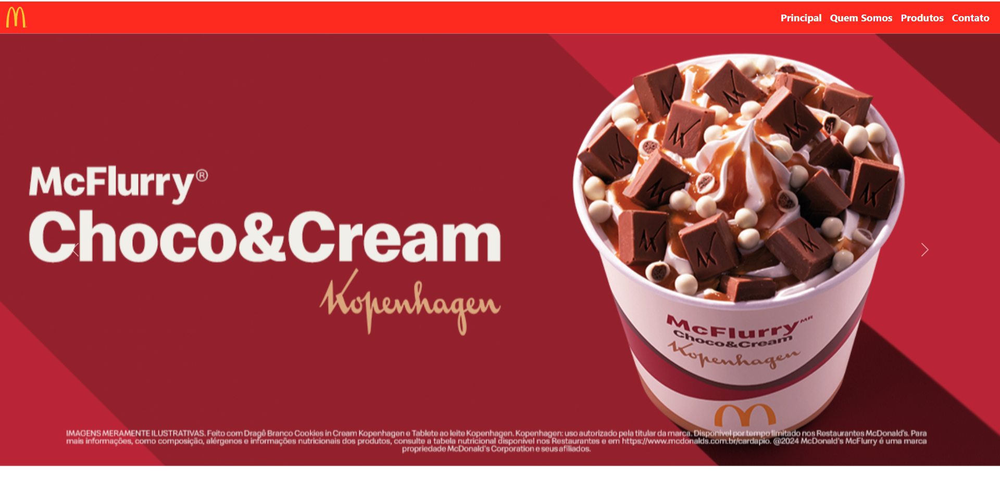
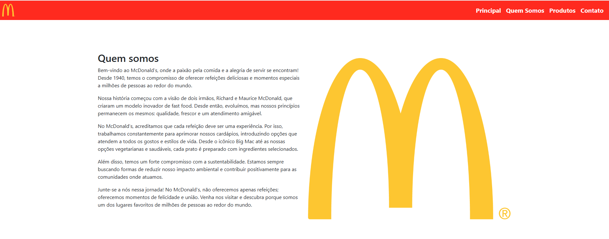
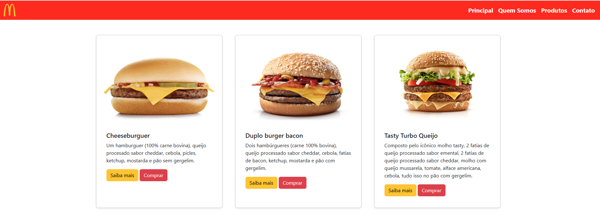
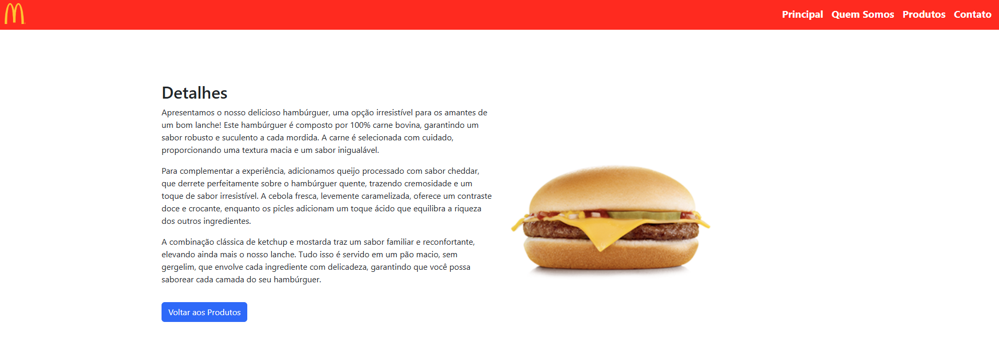
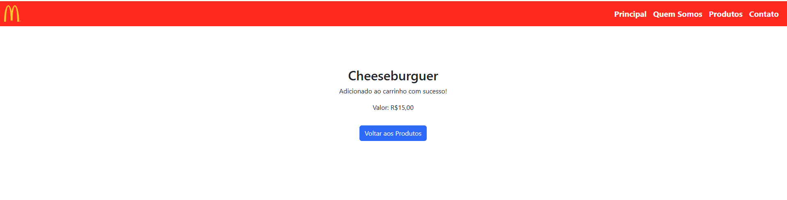
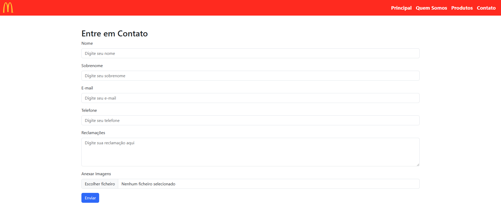

# site_bootstrap

## Introdução

Este projeto foi desenvolvido para criar um site de uma hamburgueria fictícia, com o objetivo de praticar habilidades em desenvolvimento web. O site apresenta uma experiência simples e intuitiva para os usuários navegarem pela página inicial, conhecendo a história da hamburgueria, produtos oferecidos e formas de contato.

## Estrutura do Projeto

**Página Inicial:** Apresenta o nome da hamburgueria, uma breve descrição e o link para as páginas internas.

**Quem Somos:** Detalha a história da hamburgueria, missão, visão e valores.

**Produtos:** Lista os hambúrgueres disponíveis com descrição e preço. Exemplo: "Duplo Burger Bacon".

**Contato:** Formulário de contato para os clientes entrarem em contato com a hamburgueria.

## Etapas Implementadas

**1. Configuração Inicial:** Estrutura básica do projeto criada com HTML, CSS e integração com o Bootstrap.

**2. Desenvolvimento da Interface:** Implementação de uma interface amigável e responsiva para desktop e mobile.

**3. Criação do Menu de Navegação:** Navbar fixa com links para todas as páginas e uma logo.

**4. Footer com Links Rápidos:** Inclusão de um rodapé com links de navegação para facilitar o acesso.

**5. Integração do Carrinho:** Botões para adicionar produtos ao carrinho.

## Ferramentas Utilizadas

**Visual Studio Code:** IDE utilizada para o desenvolvimento do código.

**Bootstrap:** Framework CSS para criação de layout responsivo e componentes de interface.

**HTML e CSS:** Linguagens base para criação da estrutura e estilização da página.

## Conclusão

O projeto da hamburgueria oferece uma experiência de navegação fluida e intuitiva, com funcionalidades básicas para o usuário explorar os produtos e fazer pedidos. A utilização de Bootstrap facilitou a criação de uma interface visualmente agradável e responsiva.

